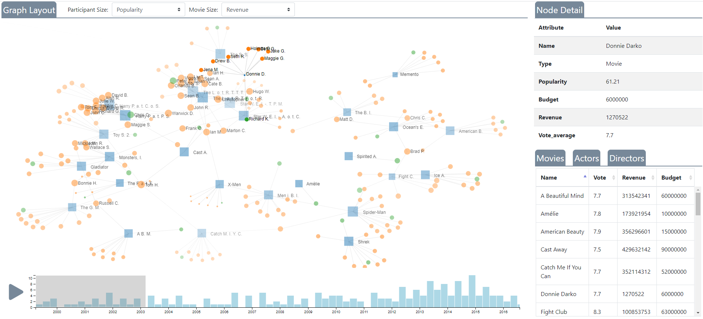

# tMDB-See-Through

Graph layout for movies.

### Usage

0. Download data from [Kaggle](https://www.kaggle.com/tmdb/tmdb-movie-metadata) to a new folder called `data`.
0. Check `data_clean.ipynb` to preprocess the data.
1. Install the requirements - `pip install` it if you cannot find a module.
2. Open terminal and `cd` to this folder.
3. For Mac: `export FLASK_APP=server.py`; for Windows: `$env:FLASK_APP = "server.py"`
4. `flask run`

### Demo

